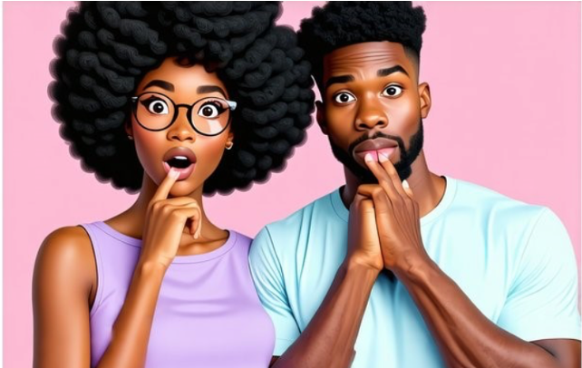
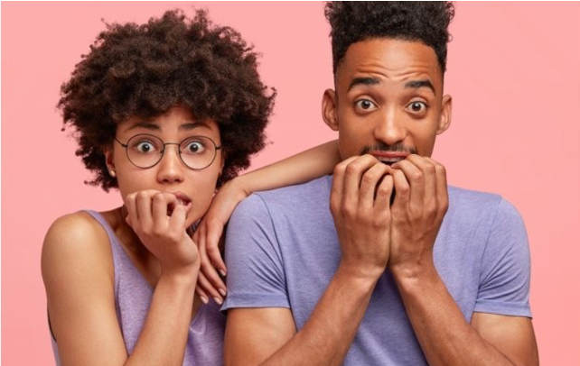

# Human vs AI Generated Image Detection

This repository contains the source code for detecting whether an image is AI-generated or human-generated. The project includes several architectures to extract and classify features using deep learning and machine learning techniques. Our primary baseline model is an improvised XGBoost implementation, as demonstrated in our Jupyter Notebook.

## Table of Contents
- [Project Overview](#project-overview)
- [Dataset](#dataset)
- [Setup and Installation](#setup-and-installation)
- [How to Run the Project](#how-to-run-the-project)
- [Models and Architectures](#models-and-architectures)
- [Preprocessing](#preprocessing)
- [Repository Structure](#repository-structure)

## Project Overview
The goal of this project is to distinguish between real, human-generated images and AI-generated images using a binary classification approach. The detection is based on a feature extraction step followed by classification. Our experiments include:
- **Deep Learning Models:**  
  Convolutional Neural Networks (CNNs), Transfomers, and hybrid models. Detailed architectures can be found in the [src/models/architectures](./src/models/architectures) folder.
- **XGBoost as Baseline:**  
  An improvised XGBoost pipeline, demonstrated with ResNet-50 for feature extraction and PCA for dimensionality reduction, serves as our base model for comparison against deep learning methods.


## Dataset
We use the **Detect AI vs Human-Generated Images Dataset** from [Kaggle](https://www.kaggle.com/competitions/detect-ai-vs-human-generated-images/data):
- **Image Count:** ~78,000 images (balanced between AI-generated and human-generated images)
- **Resolution:** 768x512 pixels
- **Content:** Images include a diverse range such as human faces, art, buildings, food, and plants.

### Dataset sample
<table>
  <tr>
    <td><b>AI-Generated Image</b></td>
    <td><b>Human-Generated Image</b></td>
  </tr>
  <tr>
    <td></td>
    <td></td>
  </tr>
</table>

Download and extract the dataset into the `dataset/` folder.

## Setup and Installation
1. **Clone the Repository**
   ```bash
   git clone https://github.com/IamShrijan/GeneratedImageDetector.git
   cd GeneratedImageDetector
   ```

2. **Create a virtual environment (`conda` recommended)**
   ```bash
   conda create --name human_ai python=3.10
   conda activate human_ai
   ```

3. **Install Dependencies**
   ```bash
   pip install -r requirements.txt
   ```

   You're ready to go!


## How to Run the Project
1. **Load Trained Models** 

   Load all the trained models to avoid training the models from scratch. The models can be found [here](https://northeastern-my.sharepoint.com/:f:/g/personal/jaganathan_p_northeastern_edu/EhL73m0rR2xAuAaTNZi_s_gBAb0AqWR9d8RerZlQXGljuQ?e=gVnYcM). 

   Download all the models and load them into `trained_models/` strictly for smooth functioning.
   
2. **Run Notebooks**

   In the current implementation of the project, we have 5 different model implementations, ie. XGBoost, ResNet, Deep CNN, Hybrid Classifier, and Vision Transformers. The trainig for each model can be found in `notebooks/`. To test the respective model run the entire notebook, and ensure you skip the training cell to avoid long training hours.


## Models and Architectures
The repository offers multiple architectures to experiment with on this detection task:
- **XGBoost Model:**  
  Our base model is an improvised XGBoost pipeline located in [xgboost_classifer.ipynb](notebooks/xgboost_classifer.ipynb)
- **CNN Model:**  
  Implemented in [cnn_models.py](./src/models/architectures/cnn_models.py) to extract deep features from images.
- **Hybrid Classifier:**  
  Explore combinations of CNN layers and traditional feature extraction in [hybrid.py](./src/models/architectures/hybrid.py)
- **ResNet:**  
  A residual network architecture found in [resNet.py](./src/models/architectures/resNet.py).
- **Visual Transformer Architecture:**  
  Leverage transformer mechanisms in [vit.py](./src/models/architectures/vit.py)


## Preprocessing
Before feeding the images to our models, we apply several preprocessing steps:
- **Padding/Cropping:**  
  Ensure images have consistent size.
- **Normalization:**  
  Pixel values scaled to [0, 1] or [-1, 1] to improve model training.
- **Shuffling:**  
  Randomizes the order of image pairs to prevent positional bias.
- **Noise Addition:**  
  Noise is added to simulate realistic image conditions, particularly for human-generated images.


## Repository Structure
```

```
